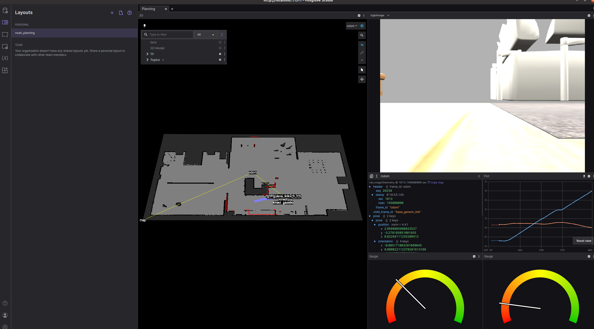
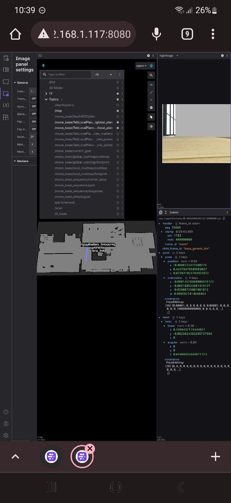

# noah_dashboard
Dashboard for Noah bot robot using [Foxglove](https://foxglove.dev/).

## Introduction

Example of using Foxglove for visualizing [Noah bot simulation](https://github.com/Ekumen-OS/Noah-bot-simulation).

## Requirements

**Platform**: Ubuntu 20.04 LTS
**ROS**: Noetic

1. After cloning the repository execute the following for bringing Noah simulation.
```sh
git submodule update --init
```

2. Depending on the use Foxglove could be used via:
  - Web app. (No installation)
  - Desktop app. (Install via Binaries)
  - Serve local web app (Clone Foxglove repo and run web server)

3. Standing at the root of the repo run:
```sh
catkin_make
source devel/setup.bash
```

## Running Dashboards

You can use Foxglove using different sources:

 

  *Note: Also rosbags can be used.*

### ROS1 Natively

In order to connect to ROS Natively the desktop app must be used.
--> [Install Foxglove desktop app](https://foxglove.dev/download)

Indicating where is running the ROS Master via using ROS MASTER URI
you can connect directly with the on going core.


For our case:
1. Launch Noah simulation:
```sh
roslaunch noah_gazebo noah_navigation.launch gui:=true
```

2. Run Foxglove Desktop app.
```sh
foxglove-studio
```
3. Go to Data Source section, then click on `Open Connection` and finally go to ROS1


For our case we leave the `ROS_MASTER_URI` in localhost and the ROS_HOSTNAME will be filled with your default hostname.

4. After clicking `Open` the connection should be succesfull and the topics will be displayed under the `Topics` tab in the left.

5. From there, you can add any panel you want and create your own dashboard. For adding the provided layout simply go to the `Layout` section and import the layout is locate under `layouts` folder



### ROS1 with ROSBridge on Desktop app
The connection via ROSBridge could be used with the Desktop app.
--> [Install Foxglove desktop app](https://foxglove.dev/download)

This is similar to the previous with the difference that we should run the ROSBridge node first.

1. Launch ROS Bridge
```sh
roslaunch rosbridge_server rosbridge_websocket.launch
```

2. Launch Noah simulation:
```sh
roslaunch noah_gazebo noah_navigation.launch gui:=true
```

3. Run Foxglove Desktop app.
```sh
foxglove-studio
```

4. Go to Data Source section, then click on `Open Connection` and finally go to Rosbridge

Our rosbridge node is being run at port 9090 by default so just clock `Open`.

### ROS1 with ROSBridge on Foxglove Web app

You can directly go to https://studio.foxglove.dev/ for using the web app that is being served by Foxglove. Here you are not allowed to connect with ROS natively but the ROSBridge connection works correctly.
The only issue could appear when trying to connect to a ROSBridge that isn't achievable via localhost or via public ip.

### ROS1 with ROSBridge on Local web app

Let's serve a web application locally. This will allow us to connect to this web application from any device that is connected to our network.

For instance, we could run our Noah simulation + ROSBridge and serve the web application. And later on from our mobile device connect to the Web app we are serving and connect to the correspondant ROSBridge Node's ip.

1. Serve web app locally:
Clone repo:
```sh
https://github.com/foxglove/studio.git
```
Run yarn install
```
cd studio
yarn install
```
Launch the browser app:
```sh
yarn web:serve
```
*Note: Visit https://github.com/foxglove/studio for further info about requirements.*

2. Launch ROS Bridge
```sh
roslaunch rosbridge_server rosbridge_websocket.launch
```

3. Launch Noah simulation:
```sh
roslaunch noah_gazebo noah_navigation.launch gui:=true
```

4. Open the browser from any device in the network and connect to the app. The server should be served at `<server-ip>:8080`
being `server-ip` the ip of the device where you executed `yarn web:serve`.

5. Within the app go to the ROSBridge connection and provide the IP where the ROSBridge node is running: `<bridge-ip>:9090`.
  For instance, from the mobile phone:
  
